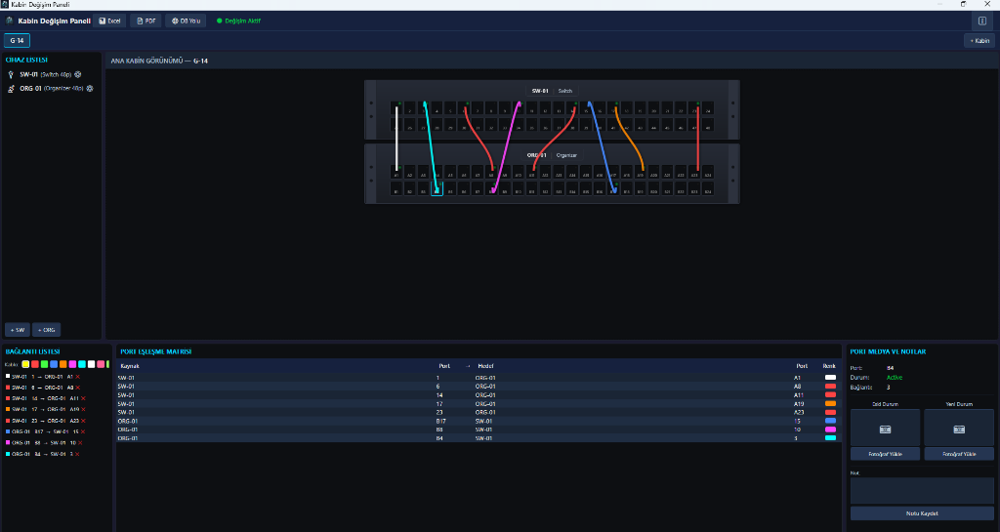
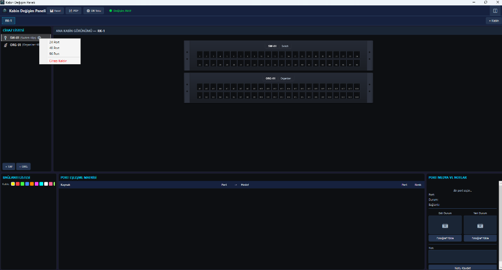
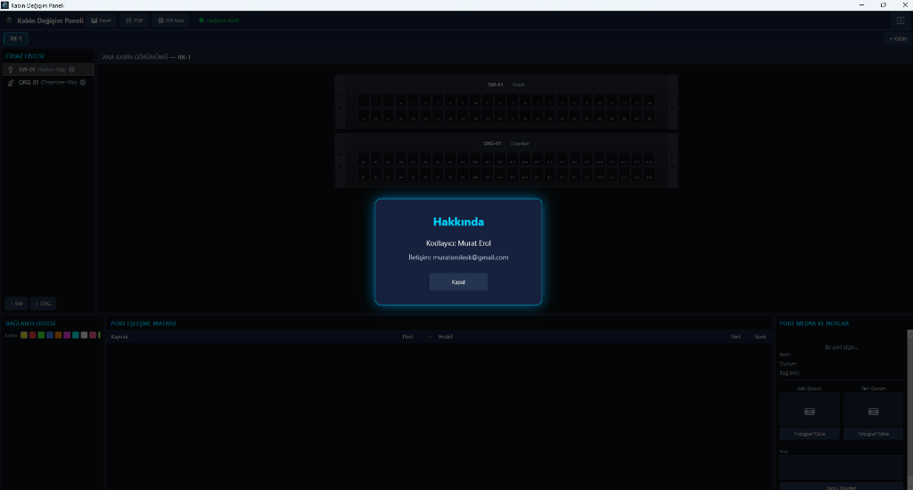

# 🚀 Cabinet Tracker Pro

**Cabinet Tracker Pro**, endüstriyel kabin yönetimi ve ağ bağlantı takibi için geliştirilmiş, yüksek performanslı ve premium tasarımlı bir masaüstü uygulamasıdır.

---

## 📸 Uygulama Ekran Görüntüleri

### Çok Renkli Akıllı Kablo Bağlantıları

### Gelişmiş Cihaz ve Port Yönetimi (Sağ Tık)

### Hakkında ve Geliştirici Bilgileri

---

## 💎 Temel Özellikler
- **Premium "Deep Dark" Arayüz:** Modern ve endüstriyel tasarım.
- **Gerçekçi Kablo Görselleştirme:** Portlar arası kavisli, çok renkli akıllı bağlantılar.
- **Gelişmiş Yönetim:** Sağ tık menüsü ile kabin ve cihaz kontrolü.
- **Raporlama:** Excel ve PDF çıktı desteği.

---

## 👤 Geliştirici
**Kodlayıcı:** Murat Erol  
**İletişim:** [muraterolesk@gmail.com](mailto:muraterolesk@gmail.com)

---

## 📦 Çalıştırma Talimatı
1. `CabinetTracker.exe` dosyasını indirin.
2. Herhangi bir klasöre kopyalayın ve çalıştırın.
3. Uygulama otomatik olarak veritabanını oluşturacaktır.

---
*Bu proje Murat Erol tarafından tasarlanmıştır.*
